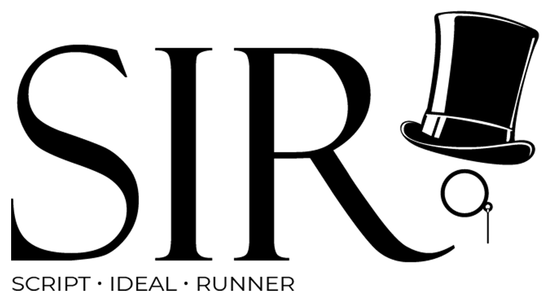

<a name="readme-top"></a>

[![Contributors][contributors-shield]][contributors-url]
[![Forks][forks-shield]][forks-url]
[![Stargazers][stars-shield]][stars-url]
[![Issues][issues-shield]][issues-url]
[![MIT License][license-shield]][license-url]
[![LinkedIn][linkedin-shield]][linkedin-url]

<br />
<div align="center">
  <a href="https://github.com/fulviocoelho/SIR">
    
  </a>

  <p align="center">
    SIR or Script Ideal Runner is a tool to help you run scripts to test your application to achive a ideal run!
    <br />
    <a href="https://github.com/fulviocoelho/SIR/issues">Report Bug</a>
    ·
    <a href="https://github.com/fulviocoelho/SIR/issues">Request Feature</a>
  </p>
</div>


## About The Project

[![Product Name Screen Shot][product-screenshot]](https://example.com)

SIR is an easy to use tool that aims to help you get a perfect test run on your plataform, to achive this we use tests written in python to have flexble test cases with database and API validations, making SIR a relaible and flexible choice to a backend E2E test run.

Write your E2E tests with python and run all of them using SIR. 

<p align="right">(<a href="#readme-top">back to top</a>)</p>


### Built With

* [![Python][Python.py]][Python-url]
* [![Node][Node.js]][Node-url]

<p align="right">(<a href="#readme-top">back to top</a>)</p>

## Getting Started

To get a local copy up and running follow these simple example steps.
1. Clone the repo
   ```sh
   git clone https://github.com/fulviocoelho/SIR.git
   ```
2. Install NPM packages
   ```sh
   yarn
   ```
3. Install husky package (NPM) - Only needed if you want to use Git
   ```sh
   yarn husky install
   ```
4. Install python packages (PIP)
   ```sh
   yarn dependencies
   ```
   
#### Python Version
SIR uses the command `python` in its code, so if you have another way to call python (e.g. `python3`) you can change the way SIR invokes python by changing the `package.json` file scripts to use your python and pip:

```
"scripts": {
    "test": "cross-env PYTHON=python python ./run.py",
    "dependencies": "pip install requests termcolor emoji"
  }
```

### Prerequisites

To run SIR you will need to have installed Python and NodeJs with yarn installed (NPM Package). Here is an example of how to install those softwares:
* npm
  ```sh
  yum install npm nodejs
  ```
* yarn
  ```sh
  npm install yarn -g
  ```
* python
  ```sh
  yum install python3
  ```

## Usage

To use SIR run the command `yarn test` and all tests on the tests folder will be executed. The execution command can receive parameters. To use the set up feature you must create inside the your test folder a folder named `SetUp`, inside it you should put the scripts `BeforeAll.py`, `AfterAll.py`, `BeforeEach.py` and `AfterEach.py`. The set up scripts will run acording to it's name (e.g. a after all script will run after all tests are done and a before each will run before each test run).

### Parameters
| parameter | values | description |
| --- | --- | --- |
| output | json / csv | save the test's outcome in a file in the designated format |
| profile | - | execute the tests on the test profile folder, all the profiles are defined in the configuration file |
| verbose | true / false | if the log tool is used the verbose enables the logs on the tests |
| stop-on-fail | true / false | if the flag is true SIR will stop all tests when a test fails |

command example: `yarn test --outcome csv --profile project_a --verbose true`

### Configuration File

The configuration file should be written in json or yaml/yml and should be named config.
**config.json**
```
{
  "profiles": {
    "default": "tests"
  },
  "styles": {
    "folder": {
      "emoji": "",
      "color": "white"
    },
    "pass": {
      "emoji": ":check_mark_button:",
      "color": "grey"
    },
    "fail": {
      "emoji": ":cross_mark:",
      "color": "grey"
    },
    "test_duration": [
      {
        "threshold": 0,
        "color": "grey"
      }
    ],
    "total_duration": [
      {
        "threshold": 0,
        "color": "grey"
      }
    ]
  }
}
```

**config.yaml**
```
profiles:
  dafault: "tests"
styles:
  folder:
    emoji: ""
    color: "white"
  pass:
    emoji: ":check_mark_button:"
    color: "grey"
  fail:
    emoji: ":cross_mark:"
    color: "grey"
  test_duration:
    - threshold: 0
      color: "grey"
  total_duration:
    - threshold: 0
      color: "grey"
```

#### Custom Styes
In our tool we use a set of libraries to help us get the style we want when printing the result on the terminal. To achive this we use [termcolor](https://pypi.org/project/termcolor/) and [emoji](https://pypi.org/project/emoji/). So if you want to customize your tests output style on terminal you can check the [colors](https://pypi.org/project/termcolor/) and [emojis](https://carpedm20.github.io/emoji/) from those libraries.

#### Importing Tools
To import tools on your tests you can use the following code:
```
import os
import sys

sys.path.append(os.environ['APP_PATH'])

from tools import log, storage
```

#### Environment Variables
When SIR is initialized its set it self the following environment variables:
| parameter | description |
| --- | --- |
| PYTHON | the python version that is used to run the tests |
| APP_PATH | the path that SIR is in you machine |
| BASE_PATH | the path to the tests executed in SIR run |
| VERBOSE | flag to tell if logs should be printed |
| STOP_ON_FAIL | flag to tell if SIR should stop on the first error found in tests |

<p align="right">(<a href="#readme-top">back to top</a>)</p>


<!-- ROADMAP -->
## Roadmap

- [X] Tests Profiles
- [X] Verbose Flag
- [X] Report Output
  - [X] JSON
  - [X] CSV
- [X] Tools
  - [X] Assertion Tool
  - [X] Logging Tool
  - [X] Local Storage Tool
- [X] Custom Styles
- [X] Stop Testing on Test Fail
- [X] Test Duration
  - [X] Basic View
  - [X] Color Threshold
  - [X] Report Info
- [X] Run Tests Automation
  - [X] Before All
  - [X] Before Each
  - [X] After All
  - [X] After Each
- [X] Total Test Duration

See the [open issues](https://github.com/fulviocoelho/SIR/issues) for a full list of proposed features (and known issues).

<p align="right">(<a href="#readme-top">back to top</a>)</p>

## License

Distributed under the MIT License. See `LICENSE.txt` for more information.

<p align="right">(<a href="#readme-top">back to top</a>)</p>

## Contact

Fulvio Coelho - contato@fulviocoelho.dev

Project Link: [https://github.com/fulviocoelho/SIR](https://github.com/fulviocoelho/SIR)

<p align="right">(<a href="#readme-top">back to top</a>)</p>

[contributors-shield]: https://img.shields.io/github/contributors/fulviocoelho/SIR.svg?style=for-the-badge
[contributors-url]: https://github.com/fulviocoelho/SIR/graphs/contributors
[forks-shield]: https://img.shields.io/github/forks/fulviocoelho/SIR.svg?style=for-the-badge
[forks-url]: https://github.com/fulviocoelho/SIR/network/members
[stars-shield]: https://img.shields.io/github/stars/fulviocoelho/SIR.svg?style=for-the-badge
[stars-url]: https://github.com/fulviocoelho/SIR/stargazers
[issues-shield]: https://img.shields.io/github/issues/fulviocoelho/SIR.svg?style=for-the-badge
[issues-url]: https://github.com/fulviocoelho/SIR/issues
[license-shield]: https://img.shields.io/github/license/fulviocoelho/SIR.svg?style=for-the-badge
[license-url]: https://github.com/fulviocoelho/SIR/blob/master/LICENSE.txt
[linkedin-shield]: https://img.shields.io/badge/-LinkedIn-black.svg?style=for-the-badge&logo=linkedin&colorB=555
[linkedin-url]: https://linkedin.com/in/fulvio-coelho
[product-screenshot]: images/screenshot.png
[Next.js]: https://img.shields.io/badge/next.js-000000?style=for-the-badge&logo=nextdotjs&logoColor=white
[Python.py]: https://img.shields.io/badge/Python-3776AB?style=for-the-badge&logo=python&logoColor=white
[Node.js]: https://img.shields.io/badge/Node.js-43853D?style=for-the-badge&logo=node.js&logoColor=white
[Next-url]: https://nextjs.org/
[Python-url]: https://www.python.org/
[Node-url]: https://nodejs.org/en/
[React.js]: https://img.shields.io/badge/React-20232A?style=for-the-badge&logo=react&logoColor=61DAFB
[React-url]: https://reactjs.org/
[Vue.js]: https://img.shields.io/badge/Vue.js-35495E?style=for-the-badge&logo=vuedotjs&logoColor=4FC08D
[Vue-url]: https://vuejs.org/
[Angular.io]: https://img.shields.io/badge/Angular-DD0031?style=for-the-badge&logo=angular&logoColor=white
[Angular-url]: https://angular.io/
[Svelte.dev]: https://img.shields.io/badge/Svelte-4A4A55?style=for-the-badge&logo=svelte&logoColor=FF3E00
[Svelte-url]: https://svelte.dev/
[Laravel.com]: https://img.shields.io/badge/Laravel-FF2D20?style=for-the-badge&logo=laravel&logoColor=white
[Laravel-url]: https://laravel.com
[Bootstrap.com]: https://img.shields.io/badge/Bootstrap-563D7C?style=for-the-badge&logo=bootstrap&logoColor=white
[Bootstrap-url]: https://getbootstrap.com
[JQuery.com]: https://img.shields.io/badge/jQuery-0769AD?style=for-the-badge&logo=jquery&logoColor=white
[JQuery-url]: https://jquery.com 
